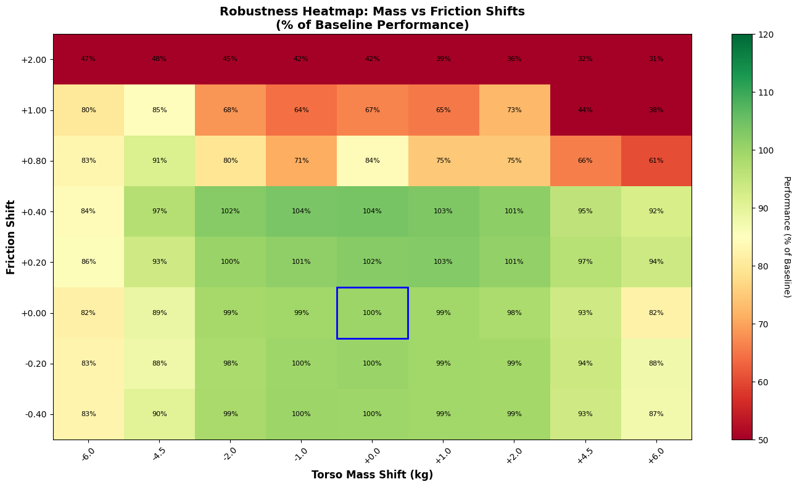
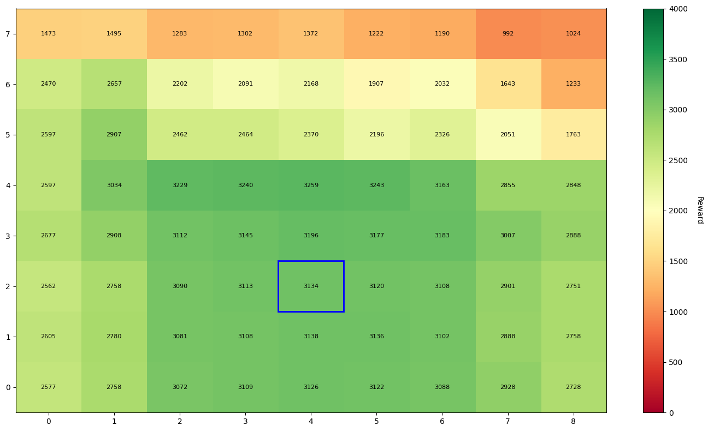
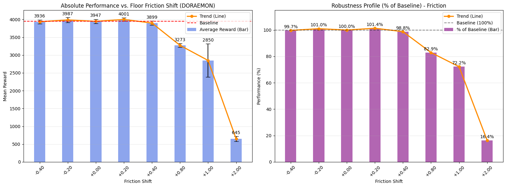
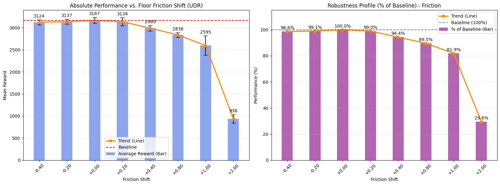
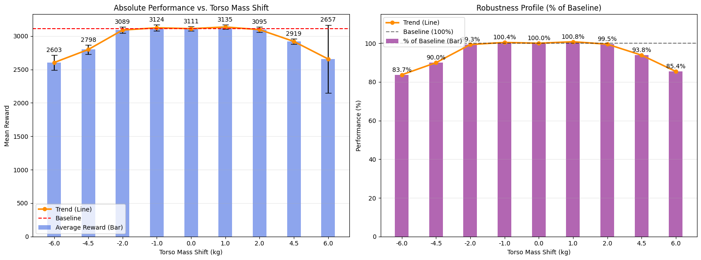

# DORAEMON+: Enhancing Adaptive Domain Randomization via Performance-Gated Warmup

**Authors:** Alessandro Benvenuti, Irene Bartolini  
**Institution:** Politecnico di Torino / University of Bologna  

[](https://opensource.org/licenses/MIT)
[](https://pytorch.org/)
[](https://mujoco.org/)

## 🎥 Demo & Visualizations

We validate our approach on high-dimensional continuous control tasks.

### 🦘 Hopper: Robustness to Unmodeled Dynamics
*Comparing nominal performance vs. recovery under extreme physics shifts.*

| **Nominal Dynamics** | **Extreme Edge Case** |
|:--------------------:|:---------------------:|
| <video src="img/hopper_original.mov" controls width="300"></video> | <video src="img/hopper_low_mass_low_friction.mov" controls width="300"></video> |
| *Standard performance on nominal physics.* | *Robust recovery under low mass/friction.* |

### 🐆 Half-Cheetah: Peak Performance vs. Conservatism
<video src="img/half_cheetah_slowed.mov" controls width="300"></video> 

---

## 📖 Abstract
Bridging the reality gap remains a critical challenge in deploying Deep Reinforcement Learning (DRL) policies onto physical systems. This project introduces **DORAEMON+**, an enhanced sim-to-real transfer framework based on *Domain Randomization via Entropy Maximization*. 

[cite_start]We introduce a novel **Performance-Gated Warmup** strategy to stabilize policy initialization [cite: 8-9]. This phase mitigates the "cold start" problem where random policies fail to provide useful gradients for curriculum updates. Experimental results on MuJoCo (Hopper & Half-Cheetah) demonstrate that this architecture significantly reduces transfer variance and achieves higher asymptotic performance compared to Uniform Domain Randomization (UDR).

---

## ⚙️ Methodology

### 1. The Problem: Gradient Failure at Initialization
Standard active domain randomization methods often fail at the start of training. When a policy is randomly initialized, its success rate is near zero ($\mathcal{G} \approx 0$). Consequently, the gradient for the distribution parameters becomes uninformative:

$$\nabla_{\phi}J \propto \sum (\sigma(\tau) - b) \nabla_{\phi} \log \nu_{\phi}(\xi) \approx 0$$

[cite_start]This leads to stagnation or random drift in the environment parameters [cite: 63-66].

### 2. The Solution: Performance-Gated Warmup
[cite_start]We implement a "latching" mechanism that freezes the distribution parameters $\phi$ until the agent achieves a minimum competence threshold $\alpha_{warmup}$ [cite: 67-68].
* **Static Phase:** Train on nominal dynamics until $\mathcal{G} \ge \alpha_{warmup}$.
* **Adaptive Phase:** Unlock $\phi$ and maximize entropy $\mathcal{H}(\nu_\phi)$ subject to the success constraint.

---

## 📊 Experiments & Results

### Experiment 1: Hopper (Emergent Robustness)
We evaluated the agent's ability to generalize to unseen dynamics (e.g., Torso Mass) even when those parameters were fixed during training.

* **Training Dynamics:** The agent successfully expands the distribution entropy over time.  
  

* **Zero-Shot Generalization:** The agent maintains near-optimal performance within a [-1.5kg, +1.0kg] torso mass shift.  
  

* **Heatmap Analysis (Torso vs Friction):** 

### Experiment 2: Half-Cheetah (7-Dimensional Randomization)
We compared DORAEMON+ against Uniform Domain Randomization (UDR) across a complex 7D parameter space (masses of all links + friction).

#### Heatmap Analysis: DORAEMON vs. UDR
These heatmaps visualize the "Feasibility Manifold" (Reward) across varying Friction and Mass shifts.

| **DORAEMON (Ours)** | **Uniform DR (UDR)** |
|:-------------------:|:--------------------:|
|  |  |
| [cite_start]*High-reward plateau ($\approx 4000$) concentrated around feasible physics [cite: 275-276].* | *Lower, diffuse performance ($\approx 3100$) due to overly conservative training.* |

#### Detailed Robustness Profiles
[cite_start]While UDR maintains marginal stability at extreme outliers, DORAEMON dominates in the "likely" physics range [cite: 275-276].

* **Friction Shift Analysis:**
    * *DORAEMON:* 
    * *UDR:* 

* **Mass Shift Analysis:**
    * *DORAEMON:* 
    * *UDR:* 

---

## 🚀 Usage

### Installation
```bash
# Clone the repository
git clone [https://github.com/your-username/doraemon-plus.git](https://github.com/your-username/doraemon-plus.git)
cd doraemon-plus

# Install dependencies
pip install -r requirements.txt
# Requires MuJoCo and Gymnasium
```


### From the Robot Learning Course - 01HFNOV
Official assignment at [Google Doc](https://docs.google.com/document/d/1XWE2NB-keFvF-EDT_5muoY8gdtZYwJIeo48IMsnr9l0/edit?usp=sharing).
