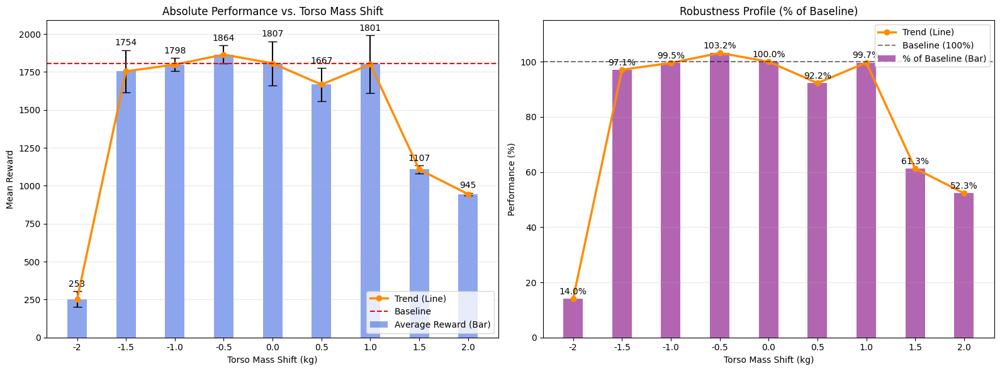
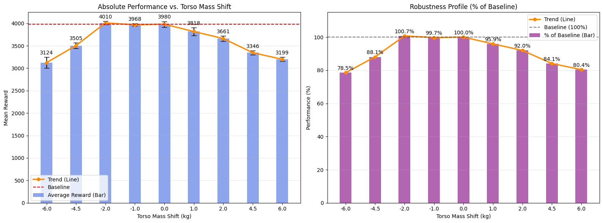
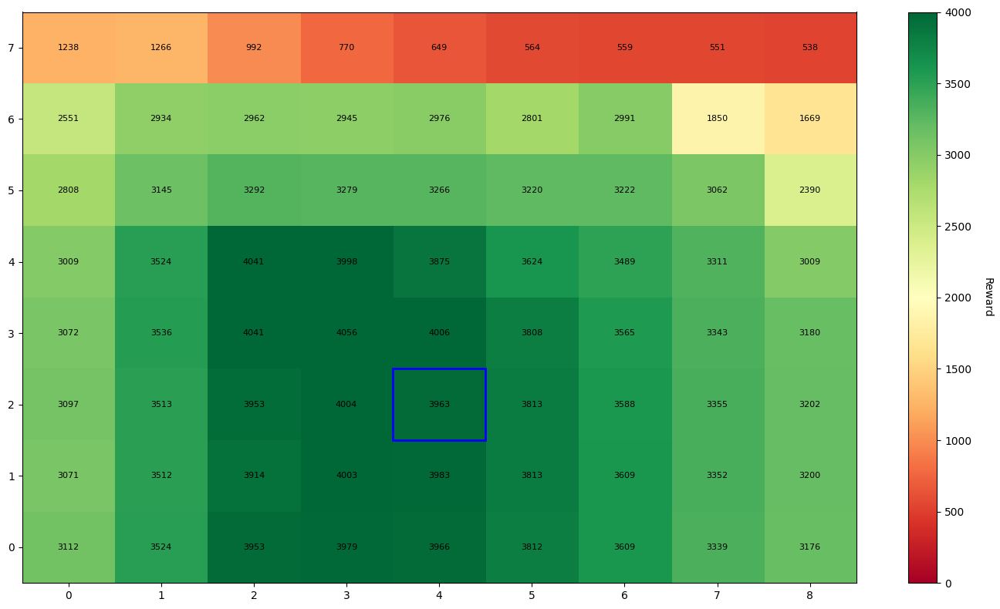

# DORAEMON+: Enhancing Adaptive Domain Randomization via Performance-Gated Warmup

**Authors:** Alessandro Benvenuti, Irene Bartolini  
**Institution:** Politecnico di Torino

---

### 🎥 DORAEMON: Consistent Performance across Dynamics

| **Source Dynamics (Training)** | **Low Friction & Low Mass (Unseen)** |
| :---: | :---: |
|  |  |
| *Agent stable on nominal parameters* | *Agent adapts to slippery, light-weight conditions* |

---

### ⚔️ Robustness Comparison: Low Mass / High Friction

| **DORAEMON (Success)** | **Narrow UDR (Failure)** |
| :---: | :---: |
|  |  |
| *Successfully overcomes high friction* | *Fails to generalize beyond narrow training range* |

---

### 🐆 Half-Cheetah: Zero-Shot Transfer to Heavy/High-Friction Dynamics

| **Source Dynamics (Nominal)** | **Target: High Mass & High Friction** |
| :---: | :---: |
|  |  |
| *Efficient gait on standard training parameters* | *Maintains high speed despite heavier body and rougher ground* |

---

## 📝 Abstract

Bridging the reality gap remains a critical challenge in deploying Deep Reinforcement Learning (DRL) policies onto physical systems. While domain adaptation methods have shown promise, they often suffer from initial instability and slow convergence during the transfer phase.

This project introduces an enhanced sim-to-real transfer framework based on **DORAEMON** (Domain Randomization via Entropy Maximization), augmented with a novel **Performance-Gated Warmup** strategy. This warmup phase is designed to stabilize policy initialization, effectively mitigating the distribution shift between simulated and real-world dynamics before full adaptation begins.

We validate our approach on high-dimensional continuous control tasks, specifically using the MuJoCo Hopper and Half-Cheetah environments. Results demonstrate that our architecture significantly reduces transfer variance and achieves higher asymptotic performance compared to standard baselines.

---

## ⚙️ Methodology

### 1. The Core Problem: The Reality Gap
Standard Domain Randomization (DR) often requires tedious manual tuning.
* If the distribution is **too narrow**, the policy fails to generalize.
* If the distribution is **too wide**, the policy becomes over-conservative, and performance collapses.

### 2. DORAEMON (Background)
We adopt the DORAEMON framework, which treats the sampling distribution as a dynamic entity. It utilizes a constrained optimization approach to maximize the **entropy** of environmental parameters (diversity) while maintaining a baseline level of agent performance (safety).

### 3. The Contribution: Performance-Gated Warmup
A critical vulnerability exists in the standard framework: at initialization, a random policy has a success rate $\approx 0$, leading to uninformative gradients where the optimization effectively stalls.

We implement a **Performance-Gated Warmup**:
1.  **Static Phase:** We strictly freeze distribution parameters. The policy trains on nominal dynamics until it establishes a robust manifold capable of solving the base task.
2.  **Activation:** Once the success rate $\mathcal{G} \ge \alpha_{warmup}$, the warmup concludes.
3.  **Adaptive Phase:** The standard DORAEMON update is applied, allowing the distribution to expand based on the dual optimization of entropy and success.

---

## 🧪 Experiments & Results

### 🦘 Hopper: Emergent Robustness

We evaluated the ability to induce robust behaviors against unmodeled dynamics. We trained on leg mass randomization but tested on **Torso Mass**, which was held fixed during training.

*Figure 1: Zero-Shot Robustness Analysis on Torso Mass. The agent maintains >90% performance within the [-1.5, +1.0] kg range, validating that the robust manifold generalized to unmodeled upper-body mass variations.*

#### Comparison vs. Uniform Domain Randomization (UDR)
We compared DORAEMON against Narrow, Wide, and Tuned UDR baselines. Wide UDR failed catastrophically by sampling infeasible physics.

*Figure 2: Zero-Shot Robustness Heatmaps (Mass vs. Friction). DORAEMON (Top-Left) autonomously recovers the robust performance profile of the manually Tuned UDR (Bottom-Left), significantly outperforming the Narrow baseline in high-friction regions.*

---

### 🐆 Half-Cheetah: High-Dimensional Randomization

We increased complexity by randomizing 7 parameters simultaneously (link masses + floor friction).

#### 1. Robustness to Mass Shifts
DORAEMON is remarkably robust to torso mass shifts. Even when the torso mass was reduced by 6kg (leaving only ~0.25kg), the agent retained 78.5% of its baseline performance.

| **DORAEMON** | **UDR (Baseline)** |
| :---: | :---: |
|  |  |
| *Higher performance ceiling (~4000)* | *Lower absolute reward (~3100)* |
*Figure 3*

#### 2. Robustness to Friction Shifts
A trade-off is observed: DORAEMON prioritizes peak efficiency in the "likely" training range, while UDR learns a conservative, slower gait that degrades slower at extreme outliers.

| **DORAEMON** | **UDR (Baseline)** |
| :---: | :---: |
|  |  |
*Figure 4*

#### 3. Cross-Evaluation Heatmaps
The heatmaps illustrate the policy landscapes. DORAEMON shows a "saturated" high-performance plateau, whereas UDR is more diffuse.

*Figure 5: DORAEMON Heatmap. Note the intense green plateau (approx 4000 reward) indicating mastery of the learned manifold.*

*Figure 6: UDR Heatmap. The baseline rewards are consistently lower, resulting in a lighter shade of green across the center.*

---

## 📚 References

* **[1]** X. Chen, "Understanding domain randomization for sim-to-real transfer," 2022.
* **[2]** G. Tiboni et al., "Domain randomization via entropy maximization," ICLR 2024.
* **[3]** Full technical report: `benvenuti_bartolini_report.pdf` included in this repository.
