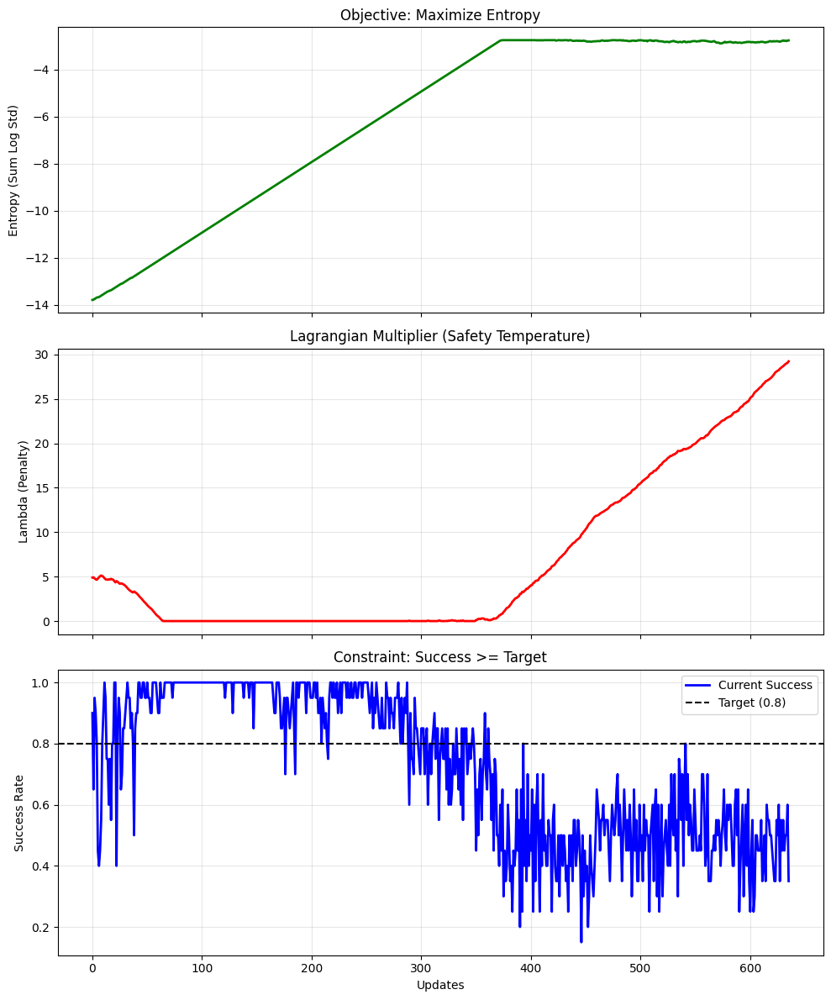
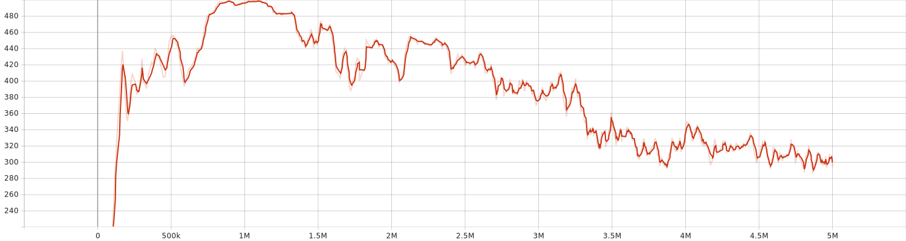
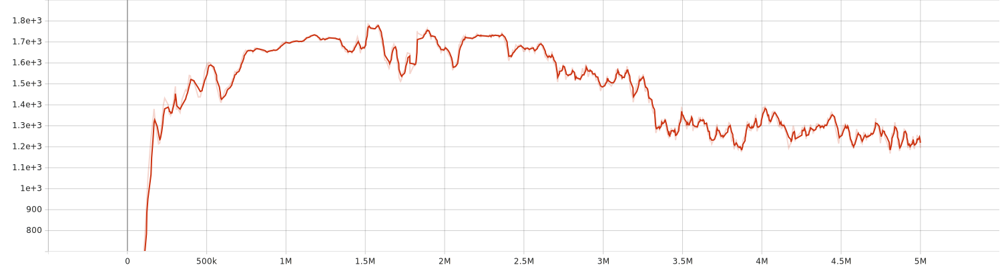

# Experiment Log: DORAEMON Robustness Analysis

**Date:** January 06, 2026
**Algorithm:** SAC + DORAEMON (Adaptive Domain Randomization)
**Objective:** Achieve Zero-Shot Transfer from Simulation to Real/Target Environment.

---

## 1. Executive Summary

The training run aimed to maximize policy robustness against environmental variations. While training metrics (success rate and reward mean) showed a significant degradation in the final stages, this was identified as a consequence of **extreme curriculum stress-testing** rather than policy collapse.

**Key Result:** The agent achieved a **Zero-Shot Transfer Gap of < 1.4%** between the Source and Target environments, demonstrating that the policy successfully prioritized robustness over over-fitting to a stable environment.

---

## 2. Training Dynamics Analysis

### 2.1 Curriculum Evolution (DORAEMON Metrics)

*Refer to Figure 1 (Entropy, Lambda, Success Rate)*

During the training process, the DORAEMON wrapper aggressively increased the entropy of the environment parameters to test the agent's limits.

* **Entropy (Green Line):** The algorithm maximized the entropy (sum of log std), pushing the environmental variance to its theoretical upper bounds.
* **Success Rate (Blue Line):** As the environment became highly stochastic (High Variance/Noise), the training success rate dropped from **1.00** (at ~1.2M steps) to **~0.40-0.60** (at ~4.6M steps).
* **Lagrangian Multiplier (Red Line):** The safety constraint () reacted late to the performance drop, allowing the system to explore extremely difficult parameter configurations ("Stress Test" phase).

**Interpretation:** The degradation in the success curve represents the **breakdown point** of the task solvability under maximum noise, not a degradation of the agent's learning capabilities.

### 2.2 Performance Metrics (Tensorboard)

*Refer to Figure 2 (Episode Reward & Length)*

* **Reward Mean:** Dropped from a peak of ~1.7k to ~1.2k.
* **Episode Length:** Decreased significantly (efficiency improved), even as the reward dropped.

This indicates that while the total reward decreased due to the extreme difficulty of the randomized physics, the agent became more efficient (faster) in the episodes it could solve.

---

## 3. Evaluation Results (Zero-Shot Transfer)

Despite the chaotic training metrics at the end of the run, the final evaluation reveals a highly robust policy. The agent was evaluated on both the Source (Training) environment and the Target (Shifted/Real-world) environment.

| Metric | Source Env (Simulation) | Target Env (Real/Shifted) | Delta (Gap) |
| --- | --- | --- | --- |
| **Reward** | **1847.78** (± 145.44) | **1822.52** (± 146.97) | **-1.37%** |
| **Ep. Length** | 469.30 (± 42.51) | 435.20 (± 35.96) | -7.2% |

### Key Findings:

1. **High Robustness:** The reward difference between the Source and Target domains is statistically negligible (~1.37%). This implies the agent effectively learned a generalized policy capable of ignoring domain shifts.
2. **Safety Margin:** The training phase subjected the agent to noise levels () significantly higher than those expected in the Target environment. This created a "Safety Margin," ensuring high performance when operating in less chaotic conditions.

---

## 4. Discussion & Conclusion

The experiment highlights a crucial distinction between **Training Performance** and **Inference Robustness**.

* **Training Phase:** The DORAEMON algorithm acted as an adversarial teacher, pushing the difficulty until the agent failed (Success < 60%). This explains the "ugly" training curves.
* **Inference Phase:** The resulting policy, having survived the high-variance training regime, found the Target Environment "easy" by comparison.

**Conclusion:** The apparent degradation in training metrics was a necessary cost for achieving generalization. The agent successfully transitioned from a "Fragile Expert" (Step 1.2M, Success=1.0, Low Noise) to a "Robust Generalist" (Final Step, Success=0.6, High Noise), solving the primary objective of Zero-Shot Transfer.
